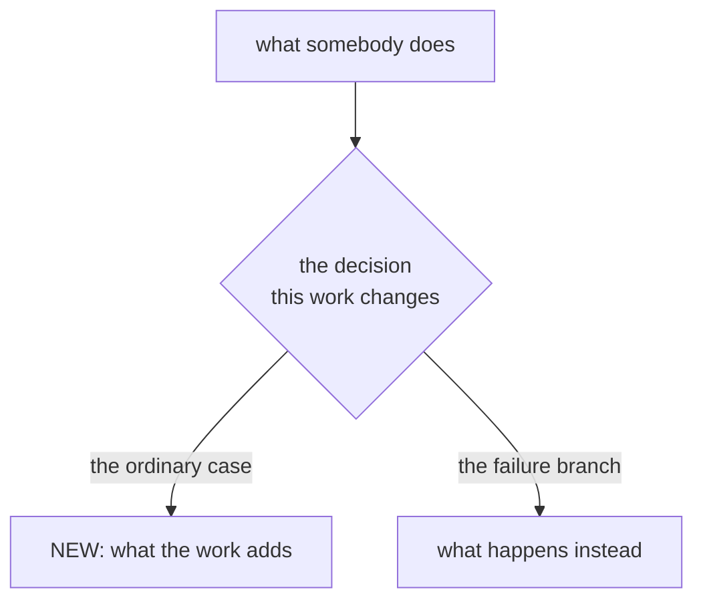

# Wiggum: Orchestrator

You **drive the `wiggum` CLI** — you do not re-implement its loop yourself. Wiggum
is a self-driving agent loop (plan → implement → verify → commit). Your job is to
turn the request into a workplan, launch wiggum on it, supervise the run, and
report the outcome. Execute without asking for confirmation.

The request: **$ARGUMENTS**

## Preflight — one step, then act

This skill is the **authoritative reference for wiggum's interface**: the commands
and flags in "The CLI you drive" and the steps below are correct and current. Use
them verbatim — do **not** burn turns running `wiggum --help` / `wiggum help execute`
to re-derive syntax you already have here.

The only things you genuinely can't know up front are repo-specific, so do this
discovery **once, in a single command**, then proceed:

```
command -v wiggum && cat .wiggumrc 2>/dev/null && ls environment.yml .venv .nvmrc Gemfile poetry.lock uv.lock 2>/dev/null
```

- **wiggum on PATH?** If `command -v wiggum` is empty, tell the user to install it
  (`./install.sh` in the wiggum repo) and stop — do not hand-simulate the loop. Run
  from the target project root.
- **`.wiggumrc`** — wiggum reads it itself; you read it here only to learn the verify
  steps (and therefore which environment to activate). No config → wiggum just skips
  verification (still fine).
- **Activate the project's environment.** wiggum runs Claude's tools and the verify
  steps in your *current* shell. If the markers above show one — conda
  (`environment.yml`), a virtualenv/`.venv`, Poetry/uv (`poetry.lock`/`uv.lock`), a
  Node version (`.nvmrc`), Bundler (`Gemfile`), etc. — activate it in the same shell
  you launch from, *before* running, or tests/builds hit the wrong interpreter and
  fail spuriously. For unattended/background runs, prefer self-activating verify
  commands in `.wiggumrc` (e.g. `conda run -n <env> pytest`, `poetry run pytest`) so
  the run is reproducible no matter which shell starts it.

That's the whole preflight. Everything else you need is in this skill.

## The CLI you drive

| Command | What it does |
|---|---|
| `wiggum plan <issue-or-file> [--plan-file docs/<slug>_plan.md]` | Write a workplan, then add its open decisions and audience analysis. Does not touch code. |
| `wiggum explain <plan-or-issue>` | Explain what a plan contains, what it is worth to users, how they would find out about it, and which decisions are still open. Read-only. |
| `wiggum execute <plan> [--max-iterations N]` | Run the loop in the foreground (blocks). |
| `wiggum execute <plan> --background` | Run detached; writes `docs/<name>.pid` + `docs/<name>.out`. Returns immediately. |
| `wiggum execute <plan> --at <WHEN>` | Wait until WHEN, then run once, detached. WHEN is `+90m` (relative), `01:07` (the next such clock time) or `@1756180020` (epoch). Creates nothing recurring; `status` reports it as scheduled and `kill` cancels it. |
| `wiggum status <plan>` | Task counts + run state (not started / running / running but appears blocked / finished: \<reason\>). Read-only. |
| `wiggum watch <plan> [--timeout S] [--kill-on-timeout] [--poll-interval N]` | Stream output and block until the run finishes — this is "wait". |
| `wiggum kill <plan>` | Stop the run (only that run's process tree). |
| `wiggum chain <plan...> [--max-iterations N]` | Execute several plans in order; stop at the first failure. |
| `wiggum chain --queue <file>` | Same, but the plan list is read from a file and re-read after every plan, so appending a line adds work to a chain already running. |
| `wiggum top` | Every run at a glance: plan, pid, state, time since last activity, RSS and CPU for the run's whole process tree, task tally. Blocked and running sort first. A footer gives load, swap and the live run count — read it before launching another run instead of shelling out to `uptime` and `sysctl`. Read-only. |
| `wiggum top --json` | The same records as JSON, with `pid`, `idle_seconds`, `rss_kb` and `cpu_percent` null when absent. Use this instead of parsing the table or asking `pgrep` about a process when the question is about a run. The footer is table-only. |

Sidecar files live next to the plan: `docs/<name>.pid`, `docs/<name>.out`,
`docs/<name>.log`. `status`/`watch`/`kill` all derive these from the plan path,
so always refer to a run by its **plan file**.

Always invoke these as `wiggum <command>` (e.g. `wiggum top`, `wiggum status`).
Wiggum's internals are shell functions named `run_top`, `run_status`, etc. — those
are **not** commands. Never call `run_top`/`run_status`/… directly: they only exist
inside wiggum's own process, so in any fresh shell (notably under `conda run …`)
they fail with `command not found`. The `wiggum` binary is the only entry point.

## Workflow

### 1. Classify the request

- **A wiggum run already in progress** — the user asks to check on / monitor /
  wait for / report on a run, or `wiggum status <plan>` shows `running`: do **not**
  start a new run. Attach to it with `wiggum watch <plan>` to follow it to
  completion (your "wait"), then report a summary (step 5). If you don't know which
  plan, run `wiggum top` — with no arguments it lists every run in flight
  anywhere on this machine, not only the ones under the current directory, so a
  run you started from another project still shows up. This is the common
  "what's my background run doing?" case.
- **An existing plan file** (path ending in `_plan.md`, or a markdown file full of
  `- [ ]` tasks): skip to step 3.
- **"chain: a.md b.md c.md"** or several plan paths: this is a chain — go to
  "Chaining" below.
- **An issue file or a free-text description**: create a plan first (step 2).

### 2. Create a wiggum-compatible workplan

Either run `wiggum plan "<issue or file>"` (it writes `docs/<slug>_plan.md`), or
write the plan yourself in the format below. A wiggum plan is a markdown checklist:

```markdown
# <Title>

## Expected benefits
1. <the outcome someone gets, in their terms — not the change being made>
   Signal: <the observable thing that shows it landed after shipping>
2. <the next benefit, ranked below the first> — **speculative**
   Signal: <what you would measure once it can be measured>

## Constraints
- In scope: <what this work will do>
- Out of scope: <what it deliberately will not do>
- Never do: <actions that would be wrong here>

## The shape of it

<two or three sentences naming what the reader should take from it>

<!-- defect work only — omit all four sections for feature work -->
## Symptoms
- <what is observably wrong, in the terms of whoever sees it> — **observed**
- <what follows from the code but you have not seen happen> — **predicted**
- The tell: <the signal that separates this defect from the benign explanation>

## Root cause
1. <step from the entry point toward the failure> — `path:line`
2. <next step> — `path:line`

## Why existing verification missed it
<the blind spot, citing the tests that pass anyway; if a passing test pins the
buggy behaviour, name it>

## Blast radius
<what is affected — and explicitly what is unaffected, and why>

## Phase 1: <name>
Serves: benefits 1, 2
- [ ] <discrete task>
  Acceptance: <observable outcome — a passing test, a specific log line, a file
  that exists, a command that exits 0>. Never a feeling ("works", "looks right").
  Files: <best-effort paths this task creates or modifies>
- [ ] <next task>
  Acceptance: ...
  Files: ...

### Acceptance Criteria
**Happy Path** — Given <context>, When <action>, Then <observable outcome>.
**Edge Cases** — empty, boundary, or large inputs behave correctly.
**Error States** — invalid input or a failed/unavailable dependency fails safely
with a clear error.
**Non-Functional** — name an observable check (a benchmark command, a lint rule,
a measurable threshold), never a feeling.
```

Rules for a good plan:
- **Start from the benefits, not from the tasks.** The plan opens with
  `## Expected benefits`: a numbered list, most valuable first, of what the work is
  *for* — each one an outcome someone gets, never the change being made ("a failed
  verify names the offending file in one line" is a benefit; "refactor the error
  handler" is not). Each benefit gets a `Signal:` line — the observable thing that
  shows it landed *after shipping* (a number that moves, an error that stops
  appearing, a manual step nobody performs any more) — and a benefit you can't
  measure yet is marked **speculative** rather than dressed up. Then derive the
  phases from that list: every phase carries a `Serves:` line naming the benefit
  numbers it delivers, and a phase that serves none is scope creep — cut it, or
  name the benefit that justifies it. If the benefits don't justify the work as
  scoped, say so in one line at the top and propose the smaller version that does.
  This is what stops a plan from being a tidy list of edits nobody needed.
- Then, still before any phase, add a `## Constraints` section as a self-check
  — `In scope`, `Out of scope`, and `Never do` — then derive the phases so they
  stay within those bounds.
- **Cite the issues the plan comes from.** Find where the repo tracks them — the
  issue or spec files the plan was built from, and any tracker in version control
  (`ISSUES.md`, `TODO.md`, `ROADMAP.md`, `docs/issues*.md`, a `CHANGELOG` section,
  a status table inside the plan's own issue file) — and name the open entries each
  phase addresses, with `path:line` where you can. This is what lets phase 3 close
  exactly those entries and no others instead of inferring which ones this work was
  about (step 3f). A phase that closes no tracked entry says so rather than leaving
  it ambiguous, and if the repo keeps no ledger the plan says that in one line.
  Never cite an entry you have not read: a plan pointing at an issue that does not
  exist is worse than one pointing at nothing.
- **Say what is still open, and who the work is for.** `wiggum plan` adds these
  itself in a feedback pass, and `wiggum explain <plan>` produces them on demand for
  a plan you did not write — but if you are writing the plan by hand, include them:
  an `## Open decisions` section (the choices a person still has to make, each with
  its options, what each buys and costs, and rough effort — or one line saying
  nothing is open), and a `## How this reaches users` section naming the README
  sections, `--help` text, release notes or web pages somebody would have to read to
  learn the feature exists. A feature nobody can discover has not shipped, and the
  doc task that fixes it belongs in the plan rather than in somebody's memory.
- **Draw it before you phase it.** After the constraints and before the first
  phase, add `## The shape of it`: one mermaid diagram of the thing the plan acts
  on, and two or three sentences saying what to take from it. Choose by what the
  work changes — a **user flow** (`flowchart TD`) when it changes what somebody
  experiences, an **architecture** diagram (`flowchart LR`) when it changes how
  components call each other, a **sequence** diagram when it is about ordering
  across systems (a webhook, a retry, a cutover). Draw the system as it will be
  *after* the work and mark the nodes the plan adds or changes, so the blast
  radius is visible at a glance. Label nodes in the reader's words, not function
  names; stay under ~20 nodes; put decisions in rhombus nodes and name every
  branch **including the failure branch**, because the branch nobody drew is the
  one nobody built. This is a scoping check, not decoration: a plan whose diagram
  cannot be drawn is a plan whose scope is not yet understood, so say that in the
  section and make the first phase the research that would let you draw it.
- Every task is a real Markdown checkbox line — `- [ ]` (GFM `*`/`+` bullets also
  count) — with its own **Acceptance:** and **Files:** lines. This matters
  mechanically: wiggum tracks progress by *counting* `[ ]`/`[x]`/`[~]` checkboxes,
  so a "task" written as a heading, bold text, or plain prose has no checkbox, is
  invisible to wiggum, and makes the run report `0 tasks` and stop immediately. A
  task without observable acceptance is a wish, not a step.
- `[x]` = done, `[ ]` = pending, `[~]` = dropped (terminal — wiggum won't re-pick
  it). Record why on the `[~]` line.
- \`[~]\` means *decided against*, not *waiting on somebody*. It is terminal: the
  run skips it and the summary files it under "What was dropped", so a task parked
  there because a person still has to decide is silently recorded as abandoned. If a
  phase needs a human decision first, do not mark it \`[~]\` -- leave the tasks
  \`[ ]\`, say in the phase header that it is gated, and keep that plan out of the
  queue (or split the gated phase into its own plan that nobody runs yet). Reserve
  \`[~]\` for work someone has actually decided not to do, and record that decision
  and its date on the line.
- Give each phase its own phase-level **### Acceptance Criteria** section, in
  addition to (not instead of) the per-task `Acceptance:`/`Files:` lines. Organize
  it into four categories: **Happy Path** (the primary flow works end to end),
  **Edge Cases** (empty, boundary, or large inputs), **Error States** (invalid
  input or a failed/unavailable dependency fails safely with a clear error), and
  **Non-Functional** (performance, formatting, accessibility). Every Non-Functional
  criterion must name an *observable check* — a benchmark command, a lint rule, a
  measurable threshold — never a feeling. `Given <context>, When <action>, Then
  <observable outcome>` is the recommended form, but a plain observable pass/fail
  line is fine where Given/When/Then is overkill.
- Before finalizing, confirm the APIs/commands the plan assumes actually exist
  (grep the repo). Don't plan around a hallucinated API.
- Every statement the plan makes about *current* behaviour cites its source as
  `path:line`, and you must have read that line before citing it — no citation
  from memory or inference. This complements `Files:`: `Files:` covers what a task
  will write, the citations cover what you read to justify the plan.
- Before planning a task that adds a test to an existing file, read that file's
  harness. Module-scope mocks (`vi.mock`, `jest.mock`, fixtures, monkeypatching)
  are hoisted per file and can make the intended test impossible there, so the task
  must state whether the test can live in that file or needs a new one. Never plan
  to weaken an existing mock so a new test fits.
- When the input is a defect report, diagnose before prescribing: the four sections
  above (`## Symptoms`, `## Root cause`, `## Why existing verification missed it`,
  `## Blast radius`) go before the phases, with every symptom tagged **observed**
  or **predicted**. For work that isn't a defect, omit them rather than inventing
  symptoms.
- Apply the four risk gates, and mark a gate whose trigger is absent as *not
  triggered* rather than dropping it silently: (1) **measure before you act** — a
  phase justified by a claim about production data or runtime state starts with a
  read-only measurement of that claim; (2) **activating never-run code is not a
  no-op** — precede it with a read-only impact report over real inputs; (3)
  **irreversible work carries four conditions** — default to a dry run, export the
  affected rows before the first real write, be idempotent, and record the affected
  count per scope; (4) **a new guard must pass on a clean tree** — enumerate the
  legitimate exceptions up front, and its acceptance states that the guard passes
  against current code on its first run and fails when the defect is reintroduced.
- Close the plan with a `## Sequencing — what can ship independently` section
  naming, for every phase, whether it can ship independently or must wait, and why.
  This is not the task-dependency list: `Depends on:` orders the work, this states
  shipping risk. A fix that only turns nulls into values ships freely; a fix that
  can delete good data waits for the measurement that bounds its blast radius.
- **Tie a claim to its artifact.** When tasks write a report, a status table, or a
  changelog *about* something they produce, add a guard asserting the record matches
  reality — a row claiming a trained model names a checkpoint that exists on disk, a
  row marked done names a real output. Agents fill in a row optimistically before the
  work behind it finishes, and a plausible false record is worse than a missing one.
  In a real run this guard is what stopped a report claiming a model was trained
  while its training was still running.
- **A parity claim must be tested against the pre-change code.** When a task's
  acceptance is "behaviour is unchanged when the switch is off", a test comparing the
  new code's two paths to each other proves only internal consistency: a diff that
  removes lines can pass it while having moved the baseline. Say in the task that the
  comparison is against the previous commit — extract the old file
  (`git show <ref>:<path>`) and compare outputs, or pin a digest computed on the
  clean tree. Prefer pinning a digest over pure inputs (a transform, a parser); for
  anything whose output depends on the BLAS library or thread count, such as trained
  weights, a pinned digest is flaky and the old-vs-new comparison is a one-time
  migration check instead.
- **A task doesn't have to be an edit — it has to be actionable.** Two kinds earn
  their place beside code changes, and both are still real checkboxes with
  `Acceptance:` and `Files:` lines:
  - **Research / a deep-dive spike**, when the plan depends on something not yet
    known. Put it *before* the work that depends on it, and make its acceptance a
    written artifact — findings in a file, a measured number, a recorded decision —
    never "understand X". The dependent task names what the research must return
    and what a given answer would change. An unknown left implicit becomes a
    mid-run stall; an unknown given its own task is just the first step.
  - **A nested wiggum run**, when a sub-problem is big enough to be its own
    workplan. The task runs `wiggum plan "<sub-problem>" --plan-file
    docs/<sub>_plan.md`, then `wiggum execute docs/<sub>_plan.md --max-iterations N`
    in the *foreground* (it is already inside a run — a `--background` child would
    outlive the iteration that started it, unsupervised). Acceptance: the child's
    `docs/<sub>_summary.md` exists and its boxes are checked. Delegate only
    self-contained sub-problems, always bound the child with `--max-iterations`,
    and never fan several children out at once — they compete for the same machine.
    If you find yourself planning three of these, you wanted `wiggum chain` at the
    top level instead.
- Keep plans focused. Very large plans (40+ tasks) tend to stall — split them and
  `chain` instead.

Confirm the plan looks right, then continue.

### 3. Execute and supervise

**Pick the launch mode from how long the job will run — before anything else.**
Most supervision pain comes from launching a multi-hour plan the way you'd launch
a five-minute one. Estimate roughly: a real workplan spends *minutes per task*,
and the verify step runs over the whole repo after every task (and again after
each fix attempt), so a 35-task plan on a big suite is hours, not minutes.

| Job length | Launch it | Wait on it | Why |
|---|---|---|---|
| Minutes, a handful of tasks | `wiggum execute <plan>` foreground | it blocks | Nothing to supervise. |
| Longer than one tool call, shorter than your session | `wiggum execute <plan> --background --max-iterations N` | `wiggum watch <plan>` | You get `status`/`watch`/`kill` and a `.pid` sidecar. |
| Longer than your own session | detached `screen`/`tmux`, wiggum **foreground inside it** (§3a) | `screen -ls` + a PID check | `--background` dies with the session that started it. |

If you are unsure which of the last two you are in, assume the third. Re-launching
a plan is cheap (phase 1 reconciles the repo against the plan); losing four hours
of a run to a session teardown is not.

**Both budgets get sized, and they are not the same budget.** A long job has two
independent ceilings and under-sizing either one ends the run early:

| Flag | Bounds | Size it by |
|---|---|---|
| `--max-iterations` | how many **tasks** it may attempt | `open × 2 + 3` (below) |
| `watch --timeout` | how long **you** wait, in seconds | the plan's realistic wall clock, generously |

Setting a six-hour `--timeout` on a 25-iteration budget for a 35-task plan is
incoherent: the wall clock is irrelevant once the iteration ceiling stops the run
two-thirds through. Compute the iteration budget from the plan, then set a timeout
that comfortably exceeds how long that many iterations will take. When you cannot
estimate the wall clock, use a large `--timeout` **without** `--kill-on-timeout`
so an overrun leaves the run alive for you to inspect rather than killing healthy
work.

**If a human suggests an iteration number, check it against the box count before
using it.** "use --max-iterations 25" on a 35-box plan is a number that cannot
finish, and taking it literally buys a guaranteed re-run. Do the arithmetic, say
what it comes to and why, and launch with the sized figure — this is a correction
they will want, not an instruction to follow off a cliff.

**First, activate the project environment** (from preflight) — *before* you launch,
not after. Launching `-b` into the wrong env means the verify steps (pytest/ruff/…)
run under the wrong interpreter and thrash, and you waste a `kill` + relaunch.
`wiggum execute` prints an environment line at startup; if it warns that no env is
active, stop, activate it, and relaunch.

**Size the iteration budget to the plan, on the FIRST launch.** An iteration
completes roughly one task, so a run needs at least as many iterations as the plan
has open checkboxes, plus headroom for the ones that need a second pass. The
default is **30** — from `--max-iterations`'s built-in default, the `max_iterations`
in the `.wiggumrc` templates wiggum generates, or a `.wiggumrc` written for an
older, smaller plan — and a config written for a smaller plan is almost always
wrong for a real workplan. An undersized budget — 3 iterations on an 11-task plan
— does not fail loudly; it stops `incomplete` about a quarter of the way in, which
reads like a stall and costs a supervise cycle to diagnose.

So count the boxes and pass the flag explicitly — **always**, even when
`.wiggumrc` already sets `max_iterations`, because the flag overrides it and you
should not have to read their config to get this right:

```
open=$(grep -c '^ *[-*+] \[ \]' docs/<name>_plan.md)
wiggum execute docs/<name>_plan.md --background --max-iterations $(( open * 2 + 3 ))
```

`open * 2 + 3` is a reasonable rule of thumb — roughly two passes per task plus
slack. Do **not** economise here: iterations are a *ceiling*, not a target. Wiggum
stops as soon as every task is done, and it stops on its own stall detection long
before it burns a large budget, so an over-generous ceiling costs nothing while a
tight one reliably costs a re-run. If you catch yourself re-running a plan purely
because it stopped `incomplete`, the budget was too small at launch.

**Size it to tasks, not to how flaky the suite is.** Verification has its own,
separate budget: a failing `verify` step spends `max_validation_retries` (default
5, per verification step), never `max_iterations`. So a flaky or slow test suite
cannot exhaust the iteration budget, and padding `--max-iterations` does nothing to
absorb it. The two knobs answer different questions — *how many tasks are there*
versus *how many fix attempts does a failing check get* — and conflating them leads
to sizing the wrong one. If verification is the problem, the levers are narrowing
the `verify` command or `--no-verify` (see the verify tax below), not a bigger
iteration ceiling.

Then launch detached so you can monitor and bound it:

```
wiggum execute docs/<name>_plan.md --background --max-iterations <sized above>
```

Then supervise in a loop until it finishes:

1. `wiggum status docs/<name>_plan.md` — read **State** and the task counts.
2. While **State** is `running`, `wiggum watch <plan>` it — always watch a running
   workplan through to the end rather than leaving it unattended:
   `wiggum watch docs/<name>_plan.md --timeout 1800 --kill-on-timeout`
   `watch` streams the run's output and blocks until it ends (your "wait");
   `--timeout`/`--kill-on-timeout` bound a stuck run. **Tune the timeout to the
   plan's size, and drop `--kill-on-timeout` when you are not confident in the
   estimate** — 1800 s is right for a handful of tasks and will execute a healthy
   multi-hour run. Without the kill flag an overrun just returns and says the run
   is still active, which is recoverable; with it, you have destroyed hours of
   work to enforce a guess. When it returns, summarize what happened (step 5) —
   don't just leave the run finished and silent.
3. **Spot a wedged run early.** Treat the run as spinning (not working) when
   `status` reports `running but appears blocked`, or `watch` returns non-zero —
   under the hood the `.out`/`.log` shows `No progress detected`, `Stalled for ...`,
   or `Validation failed N times`. Read the tail of `docs/<name>.out` to see why,
   let it reach its natural stop (or let `--kill-on-timeout` bound it), then
   remediate in step 4. Don't keep a wedged run alive.
4. **Kill only when needed.** If a run overruns or is wedged and you must stop it,
   use `wiggum kill docs/<name>_plan.md`. This kills only that run's process tree
   (the wiggum process and the `claude` it spawned) — never a blanket kill of other
   wiggum/claude processes. Prefer `--kill-on-timeout` on `watch` so you don't have
   to babysit it.

For a quick, small run you may skip backgrounding and just `wiggum execute <plan>`
in the foreground.

### 3a. Runs longer than your own session: launch durably

`--background` daemonizes inside the **calling shell's session**. That survives you
closing a pipe; it does *not* survive the session itself being destroyed — a
terminal restart, the agent session ending, the supervising process exiting. When
that happens the whole tree goes with it, and the signature is a clean `.out`
ending mid-phase: no error, no summary file. Don't go hunting for a bug in the
plan; it was killed from outside. `nohup … &` buys immunity to SIGHUP only, so it
delays this rather than fixing it.

**A detached run still dies if the machine sleeps.** `screen` survives your session; it
does not survive the Mac suspending. On a laptop, a multi-hour run left overnight is
exactly the run that gets cut in half by a sleep nobody noticed, and the signature is
identical to the one above: a clean `.out` ending mid-phase.

**Never touch the power settings yourself.** Not Caffeine, Amphetamine or
KeepingYouAwake; not `caffeinate` or `pmset`; not System Settings. Whether the machine
stays awake is the user's decision, it has real battery and heat costs, and silently
changing it in either direction is worse than a run that stops. If a long run is being
launched and staying awake matters, **say so and let the user decide** — one sentence,
then launch anyway.

For any run you expect to outlive your own session, launch it inside a detached
multiplexer instead:

```
screen -dmS wig1 bash -lc 'source "$(conda info --base)/etc/profile.d/conda.sh"; \
  conda activate <env>; \
  exec wiggum execute docs/<name>_plan.md --max-iterations N >> docs/<name>_plan.out 2>&1'
```

Run wiggum in the **foreground inside** the multiplexer — no `--background`. The
multiplexer supplies the durability, and a daemonizing child would let its session
exit immediately and take the tree down. `tmux new -d -s wig1 '<same>'` works
identically; macOS has `screen` at `/usr/bin/screen` and no `setsid`.

A foreground run does register itself while it works — a `.pid` next to the plan
and an entry in the machine-wide registry — so `wiggum status` and `wiggum top`
find it from anywhere. But it clears both the moment it ends, and a
`kill -0 $(cat <plan>.pid)` check then reports "gone" for a plan that merely
finished, indistinguishable from a real death. The multiplexer session also
outlives any one plan. Check the session with `screen -ls` / `tmux ls` and a
process check, and read the plan's own state from `wiggum status`, which counts
its checkboxes.

**Check a PID, not a pattern.** wiggum's own `process_alive()` is `kill -0 "$pid"`
(`lib/wiggum.sh`), and that is the primitive to copy: it asks the kernel about one
process and parses no text, so nothing about other processes or terminal width can
fool it. Capture the PID when you launch (`$!`, or `screen -ls`) and check that.

Pattern-matching liveness fails in two ways that both look exactly like "the job
finished", and a waiter shaped `until ! <check>; do sleep 30; done` cannot tell
either from success, because it reads *any* non-zero exit as "gone":

- `pgrep -f` **errors** rather than returning empty when any unrelated process has
  non-UTF-8 bytes in its command line: `Regular expression evaluation error (illegal
  byte sequence)`, exit non-zero, waiter fires.
- `ps -eo pid,command` **truncates** the command column to the terminal width, so in
  a background context with no tty the match string can be cut off entirely. Use
  `ps -eo pid,command -ww` if you must match text at all.

Whatever you check, confirm a *completion* by its **artifact** — the output file
exists, the job's log has its `saved …` line — never by the absence of a process
alone. A job that dies at minute 50 also stops being a process, and the two are
indistinguishable until you look for what it was supposed to produce.

For a run wiggum itself started, skip all of this: `wiggum watch <plan>` blocks
until it finishes and streams its output.

**Verify survival before believing any launch pattern.** Every one of these failure
modes looks healthy at the five-minute mark. Don't record a pattern as working
until it has outlived at least one session teardown.

### 3b. Tasks that outlast an iteration

An iteration completes roughly one task, so a task whose work takes longer than an
iteration — training a model, a long build, a big migration — will not flip its
checkbox inside that iteration. Wiggum scores the iteration as no progress, and two
of those in a row stop the run while the real work is still going.

Handle it from both sides:

- **In the plan:** a long-running task should launch its job into its own detached
  session and record the artifact path in its `Acceptance:`. A later iteration then
  observes the finished artifact instead of restarting an hour of work. Say so in
  the task, so the implementing agent doesn't run it inline.
- **As supervisor:** never treat `No progress detected` as a stall before checking
  whether such a job is alive (next section).

### 3c. Reading the sidecars without fooling yourself

**Both sidecars append across runs, each run separated by a marker.** `.out`
carries `--- wiggum run <timestamp> ---` at the top of every run's output, and
`.log` carries the same marker on every run's entries. So relaunching a plan no longer
destroys the log of the run you are relaunching *because of* — the output you
need to diagnose it is still there, above the separator.

**Wiggum's own readers already scope themselves to the current run**, so
`wiggum status` will not report a dead run's stall as a live one, and
`wiggum watch` streams from this run's separator instead of replaying history.

**Your greps do not scope themselves.** A `grep` over the whole `.out` reads
every run at once, and two failures follow — both bit a real supervision session
before the separators existed:

- A match on a stall line from a *dead* run gets reported as current.
- A monitor that dedupes by message text records that string once, then goes
  **deaf** to the next genuine occurrence of it.

So scope the read to the current run, the same way wiggum does — everything from
the last separator on:

```
awk '/^--- wiggum run /{buf=""} {buf=buf $0 ORS} END{printf "%s", buf}' docs/<name>_plan.out \
  | grep -nE 'No progress detected|Stalled for|Validation failed'
```

Do not anchor on `=== WIGGUM RUN` — that is the *aborted-run* banner, and it
sits below the status line it reports, so slicing from it hides the status.

If you would rather count, baseline the match over the whole file before you
launch and report only the increase — but prefer scoping, because a baseline is
one more piece of state to get wrong.

`.log` is the timing record: its `phase2-validate-N-fix-M` entries give wall clock
per phase, which is how you find out where a run actually spent its time.

### 3d. Relaunching, and the pidfile race (fixed — recognise it on older installs)

**Current wiggum guards this.** `watch` and `kill` release a run's pidfile only
when it still names the pid they were supervising (`release_pidfile`), so a
relaunch that lands while an old run is winding down keeps its sidecar.

**On an older wiggum, the cleanup was unguarded** (`rm -f "$pidfile"` at the end
of `run_watch`) and deleted whatever pidfile was at that path. Kill a run and
relaunch in the same breath, and the lingering watch deletes the **new** run's
pidfile. Worth recognising, because the symptom reads as success:

- `wiggum watch` returns **exit 0** with `No background run found for <plan> (no
  pidfile)`.
- `wiggum status` drops its `State:` line.
- The run is meanwhile working perfectly.

Read that as "the run finished" and you will report a completed job that is
still going. **Confirm with the kernel, not the sidecar** — the run is detached
and reparented to init, so `ps` finds it:

```
ps -o pid,ppid,etime,command -ww | grep "[w]iggum execute <plan>"
```

If it is alive, restore the sidecar rather than restarting hours of work — but
only after confirming the pid really is that plan's run:

```
if ps -o command= -p "$pid" -ww | grep -q "wiggum execute <plan>"; then
    printf '%s\n' "$pid" > docs/<name>_plan.pid
fi
```

Either way, letting the old `watch` return before you relaunch costs nothing and
avoids the question.

### 3e. Watches are yours to tear down, and status counts are not activity

Two ways a supervisor reports progress that is not happening. Both were observed
in a real session, and in both the user was the one who noticed.

**Stop the watch when the run stops.** A persistent tail on a run's sidecar
(`Monitor`, a backgrounded `tail -f`, any long-lived poll) does not end when
wiggum does; it goes quiet, which is indistinguishable from a run that is simply
between iterations. Worse, the harness keeps advertising it: the user's status
line reads `1 monitor still running` for as long as it lives. In the observed
case that ran for sixteen hours after the run had finished, tailing a file
nothing was writing to, while the user waited for it to "do something".

So the moment `wiggum status` reports `finished: <reason>`, tear the watch down
in the same turn you report the outcome. A watch outliving its run is not
harmless bookkeeping; it is a false progress indicator you put on the user's
screen. Take the same care with a `tail -f` that greps for a completion banner:
if the log goes quiet the pipeline hangs rather than exiting.

**`wiggum status` counts checkboxes in a file, not work in flight.** `remaining`
is a `grep -c` over the plan, so it moves whenever the *plan* changes, with or
without a process. Add a phase to a finished plan and `remaining` climbs from 0
to 16 while nothing whatsoever is executing. That reads exactly like a stalled
run to anyone watching the number.

Two consequences:

- **Always read `State:` beside the counts, and quote both.** `finished: complete`
  with 16 remaining means "somebody edited the plan since the run"; `running but
  appears blocked` with 16 remaining means something is wrong. The counts alone
  cannot tell them apart.
- **If you scope new tasks without launching, say so in plain words.** "I have
  added 16 tasks and nothing is running" is the honest sentence. Silence after
  writing a phase, while the counter climbs, invites the user to assume a run is
  chewing on it.

**Never infer liveness from a watch.** A monitor that has emitted nothing for an
hour tells you nothing: the run may be mid-build, finished, or dead. Confirm with
`kill -0 "$pid"` on a PID you captured at launch (step 3a), or `screen -ls` /
`tmux ls`. Then confirm *completion* by the artifact, per step 3a: the summary
file exists, the plan's boxes moved.

### 3f. The issue ledger closes with the run

Phase 3 reconciles the **issue ledger**, not just the plan. It looks for wherever the
repo tracks the issues this work came from — an `ISSUES.md`, `TODO.md`, `ROADMAP.md`,
a `docs/issues*.md`, a `CHANGELOG` entry, a status table inside the plan's own issue
file — marks the entries this run actually finished, and records each one's commit
refs and the observed result. Entries whose tasks are still `[ ]` or `[~]` stay open,
with the reason in the summary. It will not invent a ledger the repo doesn't keep,
backfill an entry for work nobody tracked, or close a remote tracker (GitHub, Jira)
on its own — those are named in the summary for a human to close.

Two things stay yours:

- **Point it at a ledger it can't find.** If the repo tracks issues somewhere a grep
  wouldn't turn up — a `docs/issues/` directory, a table inside a README, a file named
  for the team rather than for issues — name that path in the plan (`## Expected
  benefits` or `## Constraints` is a good spot). A ledger the run can't find is one it
  will honestly report as absent, which is correct and still not what you wanted.
- **Check the record against the tree when you report.** `git show --stat` on the
  phase 3 commit says whether the ledger actually moved. The failure worth catching is
  a row marked shipped whose task is still `[ ]`: agents fill rows in optimistically,
  and a plausible false record is worse than a missing one.

### 4. If the run didn't finish `complete` — remediate and re-run

A finished run is not necessarily a done one. Read its stop reason from
`wiggum status <plan>` (`finished: <reason>`) and `docs/<name>_summary.md`. Wiggum
stops for three reasons; handle each differently:

- **`complete`** — 0 tasks remain. Go to Report.
- **`incomplete`** — it hit `--max-iterations` while still making progress; it just
  ran out of budget. The plan is fine. Re-run `wiggum execute <plan>` — phase 1
  reconciles the repo against the plan, then it continues the remaining `[ ]`
  tasks — **with a budget sized to the tasks that are still open** (step 3's
  `open * 2 + 3`), not the same ceiling that just ran out. Between runs, `wiggum
  status <plan>` must show `remaining` going *down*; if it stops dropping, treat it
  as a stall. Reaching `incomplete` at all usually means the launch budget was
  under-sized — fix that at launch next time rather than re-running repeatedly.
- **`stalled`** — no progress for two iterations in a row. Re-running as-is will
  just stall again. **Diagnose, mitigate, then re-run.**

**First, rule out a false stall.** A stall means *wiggum* saw no checkbox move, not
that nothing is happening. Before diagnosing anything, check whether work is
progressing outside the iteration window:

- `pgrep -f "<the long command the task launches>"` and `screen -ls` / `tmux ls` —
  is the job the task spawned still alive?
- Is its output still growing? Cache directory size, an output file's mtime, a
  checkpoint appearing. Take two readings a minute apart rather than one.

If something is running, **do nothing**: let it finish, then relaunch. Phase 1
reconciles the repo against the plan and marks the task done from the artifact
instead of redoing the work. Killing the run here is safe (the detached job
survives); relaunching *before* the job finishes is not useful, because the same
task will fail its acceptance the same way.

Only when nothing is running is it a real stall:

**Diagnose the stall** (don't trust the checkboxes alone):
1. Read the evidence — `docs/<name>_summary.md` ("issues encountered" / "deferred"),
   the tail of `docs/<name>.out` and `.log` (the `No progress detected` /
   `Validation failed N times` lines), and the still-`[ ]` tasks. Pin down *which*
   task didn't advance and *why*.
2. Spot-check reality vs. the plan:
   - Run the project's own checks: `wiggum check` (runs the `.wiggumrc` verify/autofix
     steps and shows the real failure).
   - `grep` the repo for the files/symbols/APIs the stuck task assumed exist.
   - Confirm whether partial work actually landed — sometimes the work is done and
     only the box is unticked (phase-1 reconcile usually fixes that, but verify).

**Mitigate — match the fix to the cause:**
- *Task too big or vague* → split it into smaller `[ ]` steps, each with a concrete,
  observable `Acceptance:` line.
- *Acceptance can't be met / is ambiguous* → rewrite it to something reachable and
  checkable.
- *Built on a wrong or hallucinated API / assumption* → fix the task after reading
  the real source; correct dependencies or ordering.
- *A `.wiggumrc` verify command is itself wrong* → surface it to the user; **don't**
  edit `.wiggumrc` (it's their config).
- *Genuinely impossible, out of scope, or superseded* → mark the task `[~]` with a
  one-line rationale so wiggum stops re-picking it (its designed escape hatch).
- *Needs access, credentials, an external dependency, or a real product decision* →
  stop and ask the user; you can't resolve it.

**Check the machine before blaming the plan.** wiggum runs Claude, the verify
steps, and anything a task spawns — concurrently with any *other* wiggum run on the
box. Read `uptime`'s load average against the core count (`sysctl -n hw.ncpu` /
`nproc`). A load many times the core count makes every verify pass several times
slower, turns a working run into one that looks wedged, and makes the supervising
session itself a candidate for being reaped. Two concurrent runs plus a training job
on a 4-core machine reached load 59 in a real session. Serialising two runs finishes
both sooner than interleaving them; if the other run isn't yours to stop, say so
rather than quietly competing with it.

**The verify tax is often the real cost.** `verify`/`autofix` run over the **whole
repo** after every task and again after **each** fix attempt (up to
`max_validation_retries`, default 5). On a large suite that dominates everything
else: measure one pass from `.log` before concluding the task's own work is slow. A
single real session spent 27 minutes on one round's three fix attempts and 40 on the
next round's one.

If that tax is the bottleneck, `--no-verify` is a **CLI flag** — use it instead of
editing `.wiggumrc`, which is the user's config. It is a real reduction in safety,
so when you spend it: say what you traded, run the specific tests that guard the
work after each task yourself, and run the full suite once before calling the work
done. Report what that final run found rather than fixing quietly and claiming a
clean finish.

Then re-execute. **Bound the loop:** at most ~2–3 remediation cycles. If it stalls
again on the *same* task after a mitigation, stop and hand the user the diagnosis
plus options instead of burning more runs — mirror wiggum's own discipline (it caps
stall and validation retries precisely to avoid runaway).

### 5. Report

When the work is done (or you've stopped to escalate), run `wiggum status <plan>`
once more and report:
- the final stop reason (complete / stalled / incomplete) and how many remediation
  re-runs it took,
- task counts (done / remaining / dropped),
- what the summary file (`docs/<name>_summary.md`) says was done and deferred,
- which issue-ledger entries the run closed and which stayed open — or, if the repo
  keeps no ledger, that the summary says so rather than leaving it silent (step 3f),
- if you stopped on a stall: the cause you found, the mitigation you tried, and the
  decision you need from the user.

## Chaining workplans

When the work spans several independent plans, run them in sequence:

```
wiggum chain docs/schema_plan.md docs/api_plan.md docs/ui_plan.md
```

`chain` runs `wiggum execute` on each plan in order, each in a fresh session, and
stops at the first plan that fails — so a broken early step doesn't waste effort on
the rest. Each plan registers its own `.pid` while it is the active one and drops it
when it ends, so `wiggum top` shows a running chain as a row for the plan it is on
right now, and nothing for the plans on either side of it.

**To add work to a chain that is already running, give it a queue instead of
arguments.** With plans in argv the list is fixed at launch and there is nowhere to
append; with `--queue` the file is re-read after every plan:

```
wiggum chain --queue docs/queue.txt --max-iterations 12
echo docs/extra_plan.md >> docs/queue.txt   # picked up when the current plan ends
```

One path per line, `#` comments, blanks ignored. A plan already run is not repeated
even if you edit the file, and a queued path that does not exist when its turn comes
stops the chain rather than being skipped. The queue also *is* the chain's plan list,
so a killed chain relaunches from the same command without you reconstructing it from
your shell history.

**`watch` is per-plan, not per-chain, and this bites.** `wiggum watch <plan>` attaches
to one run's pidfile. A plan later in the chain has no pidfile until its turn comes, so
watching it **exits 1 immediately** rather than waiting — it reads as "that run is
finished" when it means "that run has not started". There is no `watch` for "this chain,
whatever it is on". Until there is:

- Watch the plan the chain is on **now** (`wiggum top` names it), and re-check when it
  ends; or
- Hold the chain's own PID from launch and poll `kill -0 "$pid"` for "is the chain still
  going", which is a different question from "is this plan still going".

**A stale pidfile can make `watch` announce a run that is gone.** It prints the pid it
read before testing liveness, so a killed chain whose sidecar was left behind produces a
"Watching wiggum run … (pid N)" line and then returns immediately. Read the return, not
the banner, and confirm with `wiggum top` or `ps` before believing either.

**A pid alone is not an identity — never signal one you have not verified.** The kernel
reuses pids, so a sidecar left by a crash or a reboot eventually names somebody else's
process. Wiggum records the process start time next to the pid and compares it before
believing or signalling anything: a reused pid reads as "not running", and `wiggum kill`
clears the sidecar instead of firing. Do the same when you supervise a run yourself —
capture `ps -o lstart= -p "$pid"` at launch and compare it before you `kill`, because
`kill -0` cannot tell your run from whatever inherited its number.

To supervise a long chain, background it and watch the active plan's sidecars, or run
the plans one at a time with the supervise loop in step 3 so you can inspect and fix
between stages.

## Rules

- **Drive the CLI; don't reimplement it.** Plan/implement/verify/commit are
  wiggum's job. You orchestrate: plan, launch, monitor, wait, unblock, kill, chain.
- **Back out when the loop isn't warranted.** wiggum runs a full cycle *per task* —
  a fresh `claude` session, the whole verify suite, a commit. If you could make the
  change and confirm it in a single pass, say so and edit it directly rather than
  planning it; a plan that fragments one edit into eight commits costs more than it
  returns. Size and file count are the wrong test — prompt wording, a doc sweep, or
  a function copying an existing pattern is direct work even across many files. The
  loop earns its cost when steps depend on each other and each needs verifying
  before the next can be written.
- **Never ask for confirmation** — just execute.
- **Refer to runs by their plan file** — that's how status/watch/kill find the
  sidecars.
- **Always pass `--max-iterations`, sized to the plan's open checkboxes** (step 3).
  The 3-iteration default is a floor for toy plans, not a budget for a real
  workplan, and under-sizing it turns a working run into a false `incomplete`.
  Check any human-suggested number against the box count before using it.
- **Size the watch timeout too, and separately** (step 3): `--max-iterations`
  bounds tasks, `watch --timeout` bounds your wall clock. Drop
  `--kill-on-timeout` unless you are confident in the estimate — it destroys a
  healthy long run to enforce a guess.
- **Kill scope:** only ever stop the run you started (`wiggum kill <plan>`), never
  a blanket process kill.
- **`watch` waits on a plan, not a chain.** Watching a plan whose turn has not come
  exits 1 at once, which reads as "finished" and means "not started". Watch the plan
  the chain is on now, or poll the chain's own PID. And read `watch`'s return rather
  than its opening line: a stale pidfile makes it announce a pid that is already gone.
- **Add to a running chain with `--queue`, not by starting a second chain.** Appending
  a line to the queue file adds a plan to the tail; two chains over the same work
  compete for the machine.
- **The ledger closes with the run** (step 3f): phase 3 marks the issues this run
  actually finished, with their commit refs. Name a hard-to-find ledger in the plan,
  and when you report, confirm no row marked shipped sits above a task still `[ ]`.
- **Don't edit `.wiggumrc`** to make verification pass — it's the user's config. If
  a verify command itself is wrong, surface it.
- **A finished run isn't a done one.** Always check the stop reason: `incomplete`
  → re-run; `stalled` → diagnose and mitigate before re-running (step 4). Never
  re-run a stalled plan unchanged.
- **Remediate, don't loop forever.** Cap re-runs (~2–3) and confirm `remaining` is
  dropping between them; if a task stays stuck after a mitigation, escalate with the
  diagnosis instead of burning more runs.
- **Launch durably for anything long** (step 3a): `--background` dies with the
  session that started it. Use a detached `screen`/`tmux` with wiggum in the
  foreground inside it. `wiggum top` finds a foreground run from any directory, but
  the registration goes the moment the plan ends — for the session as a whole,
  check `pgrep`.
- **Rule out a false stall before remediating** (step 4): if a job the task spawned
  is still alive and its output still growing, wait and relaunch — don't rewrite a
  task that was working.
- **Scope your own greps of `.out` to the current run** (step 3c): both sidecars
  append across runs behind a separator. Wiggum's readers scope themselves; your
  `grep` does not, and an unscoped one reports a dead run's stall as current and
  then goes deaf to the live one.
- **Confirm a run ended with `ps`, not with the sidecar** (step 3d): on older
  wiggum a lingering `watch` could delete a newer run's pidfile, and the symptom
  — `watch` exiting 0 with "no pidfile" — is indistinguishable from a clean
  finish.
- **Tear down your watch when the run ends, and never read counts as activity**
  (step 3e): a monitor outliving its run shows the user `1 monitor still running`
  and reads as work in progress; `wiggum status` counts checkboxes, so `remaining`
  climbs when you *edit* the plan. Quote `State:` beside the counts, and say
  plainly when you have scoped tasks without launching.
- **Don't trust a green report over the artifact.** Read the numbers an agent writes
  into a report against the files that produced them; check that a "parity" or
  "unchanged" claim was tested against the previous commit and not against the new
  code's own second path.
- **Report honestly:** if it stalled or was killed, say so with the cause from the
  log — don't round an incomplete run up to "done". The same applies to your own
  supervision: if you turned off verification or skipped a check, say which.
